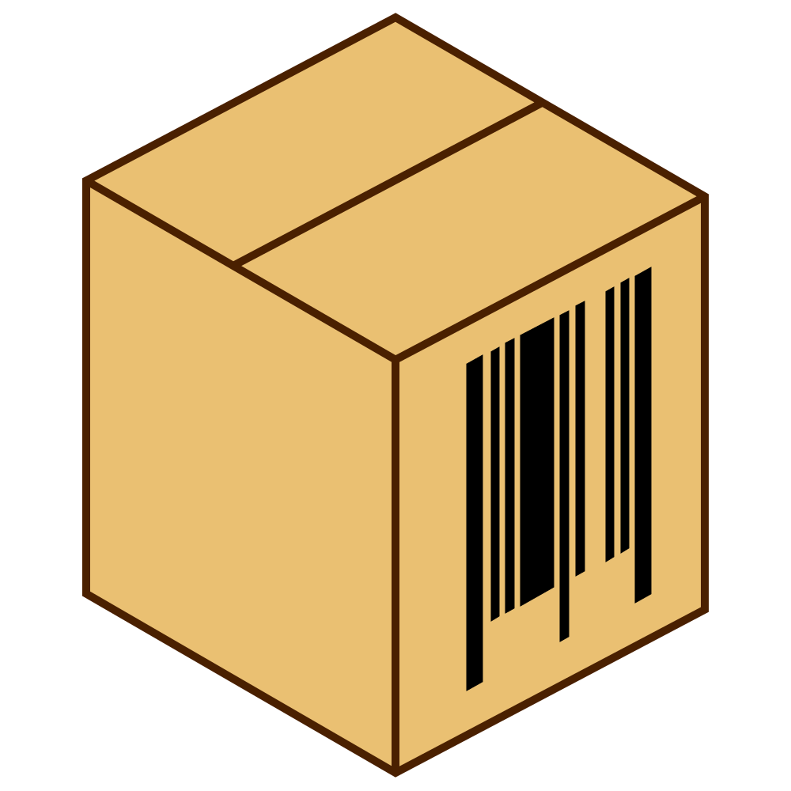

<p align="center">
  
</p>

<h1 align="center">Moving Buddy</h1>

<p align="center">
  <a href="https://github.com/SkymanOne/moving-buddy/actions/workflows/deploy.yml">
    
  </a>
  <a href="https://moving-buddy.com">
    
  </a>
</p>

A simple app that takes the chaos out of moving day. Stick barcode labels on your boxes, scan them with your phone, and keep track of what's packed, in transit, or already at the new place, all synced with a Notion database. Get your friends to help with scanning by giving them guest access.

Live at [moving-buddy.com](https://moving-buddy.com).

## How it works

1. **Connect your workspace.** Sign in with Notion and grant the app access to your databases. The free plan works just fine.
2. **Pick your database.** The app finds databases with a `Status` field and an ID field automatically.
3. **Scan a box.** Point your phone camera at a barcode or QR code. The app looks up the matching entry in your Notion database, or creates a new one if it doesn't exist yet.
4. **Update the status.** Tap a status button to mark the box as **Packed**, **In Transit**, **Delivered**, or whatever statuses you've set up in Notion.
5. **Get help with scanning.** Generate a guest share code and get a friend to help you scan the boxes. Guests don't need a Notion account, so there's no mess with workspace members, access privileges, and the like. They just scan barcodes and update the statuses in your database.

## Getting started

You'll need:

- [Node.js](https://nodejs.org/) (v22 or later)
- [pnpm](https://pnpm.io/) package manager
- A [Notion](https://www.notion.so/) account

### 1. Set up a Notion OAuth app

Head to [notion.so/profile/integrations](https://www.notion.so/profile/integrations) and create a new **public integration**. Set the redirect URI to `http://localhost:5173/auth/callback` for local development. Copy the **Client ID** and **Client Secret**.

Your database needs at least:

- A **Status** field (the built-in Status type or a Select field both work)
- A way to identify each box: either a **Unique ID** property, or the database's **title** column, which is used automatically when there's no Unique ID

A Unique ID is the better choice: your labels can encode short codes like `BOX-12` that stay stable even if you rename a box. With the title fallback, the scanned code is matched against the box's title text instead.

### 2. Install and configure

```bash
git clone <your-repo-url> moving-buddy
cd moving-buddy
pnpm install
```

Create a `.dev.vars` file for local secrets (see `.dev.vars.example`):

```text
SESSION_SECRET=generate-with-openssl-rand-base64-32
NOTION_CLIENT_SECRET=your-notion-client-secret
```

Non-secret config like `NOTION_CLIENT_ID` and `NOTION_REDIRECT_URI` lives in `wrangler.json` under `vars`.

### 3. Run locally

```bash
pnpm dev
```

This starts the Cloudflare Workers dev server via Vite. Open [localhost:5173](http://localhost:5173) on your phone or computer.

### 4. Testing on your phone

The barcode scanner needs camera access, which browsers only allow over HTTPS (or localhost). Use a tool like [ngrok](https://ngrok.com/) to get an HTTPS URL for local testing.

## Deploying

The app runs on [Cloudflare Workers](https://workers.cloudflare.com/) and deploys to a custom domain.

### Manual deploy

Set your production secrets first:

```bash
wrangler secret put SESSION_SECRET
wrangler secret put NOTION_CLIENT_SECRET
```

Update the non-secret vars in `wrangler.json` (`NOTION_CLIENT_ID`, `NOTION_REDIRECT_URI`) with your production values.

Then build and deploy:

```bash
pnpm build
pnpm deploy
```

### CI/CD

Pushes to `main` automatically deploy via GitHub Actions (`.github/workflows/deploy.yml`). You'll need these GitHub repo secrets:

- `CLOUDFLARE_API_TOKEN`: a Cloudflare API token with Workers permissions
- `CLOUDFLARE_ACCOUNT_ID`: your Cloudflare account ID

The workflow runs typecheck and build on all pushes and PRs, and deploys on push to `main`.

## Tech stack

- [React Router v8](https://reactrouter.com/), the full-stack framework with server-side rendering
- [Cloudflare Workers](https://workers.cloudflare.com/) for the edge runtime
- [Tailwind CSS v4](https://tailwindcss.com/) for styling
- [@yudiel/react-qr-scanner](https://github.com/yudielcurbelo/react-qr-scanner) for camera-based barcode and QR code scanning
- [@notionhq/client](https://github.com/makenotion/notion-sdk-js), the official Notion API SDK
- [TypeScript](https://www.typescriptlang.org/) throughout

## License

Licensed under the [Business Source License 1.1](LICENSE). Non-production use is free; production use isn't permitted until the Change Date (2028-06-23), when the license converts to the [Mozilla Public License 2.0](https://www.mozilla.org/MPL/2.0/). For a commercial license before then, get in touch.
